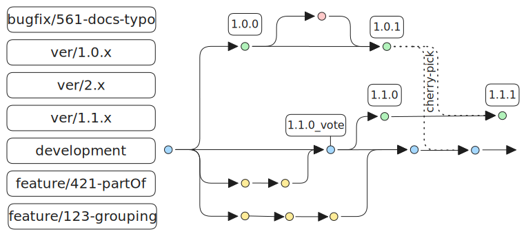

# リポジトリポリシー

## 枝

メインのワーキングブランチは`development`バージョンブランチは、次のように始まるブランチで見つけることができる。`ver`例えば`ver/1.1.x`規格の正式版には、次のようなタグが付けられている。`1.0.0`にもある。[GitHub realeses](https://github.com/buildingSMART/IDS/releases). 

## 貢献

誰でもIDSリポジトリに貢献することができます。 アイデアや問題があるけれども、それを解決する方法がわからない場合は、IDSリポジトリの[発行ボード](https://github.com/buildingSMART/IDS/issues)もし変更を加えて貢献したいのであれば、最も関連性の高いブランチ（おそらく'development'だが、バグ修正のためのバージョンブランチもありうる）をベースにした専用ブランチを作成してほしい。

変更の内容によっては、プレフィックスを追加する。`feature/`,`bugfix/`または`docs/`その後に課題番号（存在する場合）と説明的な名前が続く：`feature/<issue-number>-<descriptive-name>`

## バージョン名

IDS規格のバージョンについては[セマンティック・バージョニング](https://semver.org/)と命名した：`MAJOR.MINOR.PATCH`(例1.2.3）：
- 互換性のない変更のためのメジャーバージョン。
- 後方互換性のある方法で機能を追加するためのマイナーバージョン。
- 後方互換性のある修正のためのPATCHバージョン - 別個の認証手続きは必要ありません。
