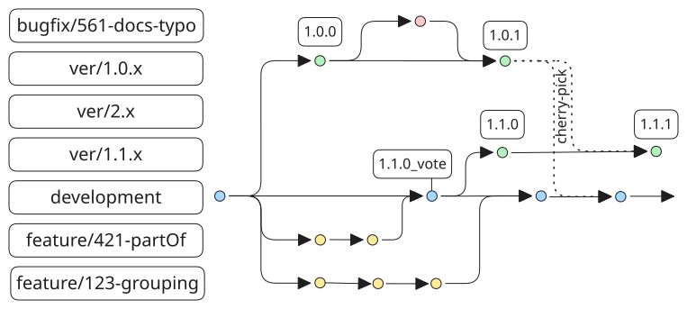

# リポジトリポリシー
## ブランチ
主な作業ブランチは`development`、開発中の最新の標準提案の状態が表示される。バージョンブランチは、`ver`始まるブランチ（例 `ver/1.1.x`）で見つけることができる。標準の公式バージョンは、`1.0.0`ようにタグでマークされ、[GitHub realesesでも](https://github.com/buildingSMART/IDS/releases)見つけることができる。 

## 貢献
誰でも IDS リポジトリに貢献することができます。アイデアや問題があるが解決方法がわからない場合は、[Issue ボードに](https://github.com/buildingSMART/IDS/issues)書き込んでください。変更を加えて貢献したい場合は、最も関連性の高いブランチ (ほとんどの場合 'development' ですが、バグ修正のためのバージョンブランチもあります) に基づいて専用のブランチを作成してください。

変更の性質に応じて、`feature/`、`bugfix/`または`docs/`接頭辞を付け、その後にissue番号（存在する場合）と説明的な名前を付けます： `feature/<issue-number>-<descriptive-name>`

## バージョン名
IDS標準のバージョンについては、[セマンティックバージョン](https://semver.org/)名に従います： `MAJOR.MINOR.PATCH`（1.2.3の例）：
- 互換性のない変更のためのメジャーバージョン。
- 下位互換性のある機能追加のためのマイナーバージョン。
- 後方互換性のある修正のためのPATCHバージョン - 別個の認証手続きは必要ありません。
