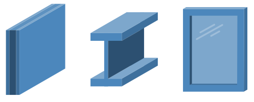

# 素材ファセット

IFCの要素（壁、ドア、窓など）や要素タイプ（壁タイプ、ドアタイプ、窓タイプなど）には、次のようなものがあります。**素材**これらに関連している。**材料**は通常、化学物質とは対照的に、建設資材として指定されている。**材料**例えば、2つの異なる等級のコンクリートは、2つの異なるコンクリートとみなされる。**材料**.

最も単純なケースでは、エレメントは単一の**素材**例えば、椅子は "木 "の素材から作られているかもしれない。**素材ファセット**を持つ要素でフィルタリングできます。**素材**.

要素は複数の**材料**の3つのシナリオが考えられる：

- **レイヤー素材**要素（例えば壁やスラブ）は、厚さを持つ材料層（例えばスタッド層、断熱層、石膏層）でパラメトリックに定義される。 各層は、それぞれ異なる**素材**.
- **プロファイルされた素材**柱や梁などの要素は、経路に沿って押し出されるプロファイル（Cプロファイル、Zプロファイル、Iプロファイルなど）でパラメトリックに定義されます。 複合柱や複合梁は、複数の異なるプロファイルを持つことがあります。**材料**.
- **構成材料**要素（窓やスラブなど）の一部が、異なる材料でできているもの。**材料**(例：窓ガラスと窓枠）または混合（例：コンクリートスラブは、セメント、骨材などの割合で構成される）。

について**素材ファセット**のいずれかが**材料**指定した**素材**.

原価計算、スケジューリング、持続可能性分析、建設業パッケージなど、多くの分野は正しいかどうかに左右される。**素材**協会である。**素材ファセット**ドメイン固有の情報には特に便利**仕様**.

## パラメータ

| パラメータ | 必須 | 制限あり | 許容値 | 意味 |
| --------- | -------- | -------------------- | ------------------------------------------------------------------------------------------------------------------------------------------------------------------------------------------------------------------------------------------------------------------------------------ | ------------------------------------------------------------------------------------------------------------------------------------------------------------------------------------------------------------------------------------------------------- |
| **価値** | ❌ | ✔️ | 材料名または材料カテゴリー。 材料名は通常、プロジェクトまたは地域の慣習に特有のものである。 材料カテゴリーは、「コンクリート」、「スチール」、「アルミニウム」、「ブロック」、「レンガ」、「石」、「木」、「ガラス」、「石膏」、「プラスチック」、「土」のいずれかを推奨する。 | その要素は、指定された名前またはカテゴリを持つ **マテリアル** で作られていなければなりません。 複数の **マテリアル** がある場合、その名前またはカテゴリを持つ **マテリアル**、 **レイヤー**、 **プロファイル**、または **構成要素** も条件を満たします。 |
| **ユーアールアイ** | ❌ | ❌ | 資料の統一資源識別子（Uniform Resource Identifier）。 この資源は名前と定義を含み、ISO 23386に準拠することが望ましい。 | 有効なURIのソースの一つは、[the bSDD](https://search.bsdd.buildingsmart.org/)である。"Plywood "のURIの例は、[https://identifier.buildingsmart.org/uri/cei-bois.org/wood/1.0.0/class/8dca70a2-01a2-489b-9381-fbeff09db8dc](https://identifier.buildingsmart.org/uri/cei-bois.org/wood/1.0.0/class/8dca70a2-01a2-489b-9381-fbeff09db8dc)である。 |

If no parameters are specified, then it means that any **Material** should be present, regardless of name or category.

## 例

| 適用意図 | 要件 意図 | ファセットの定義 |
| --------------------------------------------------------------------------------------------------------------- | ------------------------------------------------------------------------------------------------------------------- | --------------------------- |
| 重要な | 企業が重要な | パラメータなし |
| すべての実体は木でできている | 実体は木製でなければならない | 値="木材" |
| レンガで作られたすべての事業体 | 実体はレンガ製でなければならない | 値="レンガ" |
| すべての実体はコンクリートかスチール製 | 実体（基礎杭など）はコンクリート製か鋼鉄製でなければならない。 | Value=["コンクリート", "スチール"]]。 |
| CON01、CON02など、"CON "で始まるコードと2桁の数字が続く材料名を持つすべての事業体 | エンティティは、CON01、CON02 などのように、"CON "の後に 2 桁の数字が続くネーミングスキームの資料を持たなければならない。 | 値="CON[0-9]{2}" |

