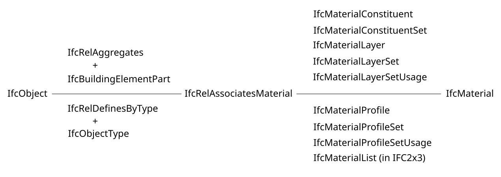

# マテリアルファセット
IFCの壁、ドア、窓などの要素には、**マテリアルが関連付けられて**いる場合があります。最も単純なケースでは、要素は1つの**マテリアルを**持つことができます。例えば、椅子の材質は"木"です。**マテリアルファセットを**使用すると、この**マテリアルを**持つ要素をフィルタリングしたり、要求したり、禁止したりすることができます。

原価計算、スケジューリング、持続可能性、構造解析など、多くの分野は、**材料の**正しい関連付けと正確なスペルに依存しています。

## パラメータ
| <nobr>パラメータ</nobr>     | <nobr>必須</nobr>       | <nobr>制限</nobr>あり         | <nobr>意味</nobr> |
| --------- | -------- | -------------------- | -------------------------------------------------------------------------------------------------------------------------------------------------------------------------------------------------------------------------------------------------------------------------------------------------------------------------------------------------------------------------------------------------------------------------------------------------------------------------------------------------------------------------------------------------------------------------------------------------------------------------------------------------------------------------------------------------------------------------------------------------------- |
| **価値**　　　　 | ❌　　　　　　 | ✔️　　　　　 | 任意の材料名またはカテゴリー。マテリアルの名前は通常、プロジェクトまたは地域の慣習に固有のものです。要素は、指定された名前またはカテゴリを持つ**マテリアルでできて**いなければなりません。複数の**マテリアルが**ある場合、その名前またはカテゴリを持つ**マテリアル**、**レイヤー**、**プロファイル**、**構成要素も**要件を満たします。 |
| **URI** | ❌ | ❌ | 資料の統一資源識別子。解釈の一貫性を確保するために、材料の標準化された定義を参照するために使用される。対象となるリソースは名前と定義を含み、ISO 12006-3 と ISO 23386 に準拠することが望ましい。IFC モデルが同じ URI を持つ必要はありません。有効なURIのソースの1つは[bSDD](https://search.bsdd.buildingsmart.org/)であり、URIの例は"Plywood [: https://identifier.buildingsmart.org/uri/cei-bois.org/wood/1.0.0/class/8dca70a2-01a2-489b-9381-fbeff09db8dc。](https://identifier.buildingsmart.org/uri/cei-bois.org/wood/1.0.0/class/8dca70a2-01a2-489b-9381-fbeff09db8dc) |
|    |    |    |    |

\* 材料カテゴリは、[IfcMaterial](https://ifc43-docs.standards.buildingsmart.org/IFC/RELEASE/IFC4x3/HTML/lexical/IfcMaterial.htm)Dのオプション属性であり、IFCによって、'コンクリート'、'スチール'、'アルミニウム'、'ブロック'、'レンガ'、'石'、'木'、'ガラス'、'石膏'、'プラスチック'、土'のうちの1つであることが推奨されています。

`value` フィールドはオプションである。オプション属性`uri` はメタデータにすぎず、IDSチェックの対象ではない。

パラメータが指定されていない場合は、名前やカテゴリーに関係なく、どんな**マテリアルでも**存在することを意味する。

## IFC 素材関係
1つのエレメントに複数の**マテリアルが**関連する可能性は3つある：

- **層状材料**：要素（壁やスラブなど）は、厚さを持つ材料層（スタッド層、断熱層、石膏層など）でパラメトリックに定義されます。各層は異なる**材料を**持つことができます。
- **プロファイル材**：要素（柱や梁など）は、経路に沿って押し出されるプロファイル（Cプロファイル、Zプロファイル、Iプロファイルなど）でパラメトリックに定義される。複合柱や梁は、異なる**材料から**作られた複数のプロファイルを持つことがあります。
- **構成材料**：異なる**材料**（例：窓ガラスと窓枠）または混合材料（例：コンクリートスラブはセメント、骨材などの割合で構成される）で構成される要素（例：窓やスラブ）。

IFC (4x3以前)では、素材([IfcMaterial](https://ifc43-docs.standards.buildingsmart.org/IFC/RELEASE/IFC4x3/HTML/lexical/IfcMaterial.htm))は、オブジェクト([IfcObject](https://ifc43-docs.standards.buildingsmart.org/IFC/RELEASE/IFC4x3/HTML/lexical/IfcObject.htm))に関連付けることができる。 [IfcRelAssociatesMaterial](https://ifc43-docs.standards.buildingsmart.org/IFC/RELEASE/IFC4x3/HTML/lexical/IfcRelAssociatesMaterial.htm)関係によってオブジェクトに関連付けることができます。 

しかし、その関係は必ずしも直接的なものではない。オブジェクトがタイプによって定義されることもあれば、より大きなアセンブリに集約された部品であることもある。また、例えばレイヤーのセットや構成要素のリストなど、素材をオブジェクトに関連付ける方法は複数ある。

IDSは、ユーザーにとって材料関係を単純化し、材料の関連付けを単純に指定できるようにし、様々な可能性のある関係の解釈をIFC-IDSチェックツールに移行します。

<!-- ⚠️TODO: in the documentation we will be explicit that traversing IfcRelDecomposition for the purpose of material evaluation will not be implemented in 1.0. We need to define what is the behaviour when it comes to the IfcRelDecomposition and the propagation of materials. -->

## マテリアルファセット解釈
### 適用性
| <nobr>素材</nobr>価値     | IDSの<nobr>解釈</nobr>         |
| -------------- | ------------------------------------------------------------------------------------------------------------------------------------------------------------- |
| -　　　　　　 | 関連するマテリアルを持つすべてのエンティティに適用される。物質的な関係を持っている物理オブジェクトだけをフィルタリングする良い方法。 |
| スチール | *Steel*(正確な綴りと大文字小文字)という名前の関連材料を持つすべての実体に適用される。エンティティがより多くのマテリアルの関連を持っている場合は関係ありません。 |

### 必要条件
| IDS<nobr>カーディナリティ</nobr> | <nobr>素材</nobr>価値     | <nobr>コンフィギュレーションを</nobr>許可しますか？ | IDSの<nobr>解釈</nobr>         |
| --------------- | -------------- | ---------------------- | ------------------------------------------------------------------------------------------------ |
| 必須　　　　　 | -　　　　　　 | ✅　　　　　　 | 適用可能なオブジェクトは、その名前に関係なく、少なくとも1つの関連素材を持っていなければならない。 |
| 必須 | スチール | ✅ | 適用可能なオブジェクトは、素材「*Steel」が*関連している必要があります。その他の素材も可能です。 |
| オプション | - | ❌ | 許されない。素材があるかないかを指定することに付加価値はない。 |
| オプション | スチール | ✅ | 適用されるオブジェクトは、素材を持っている必要はない。 |
| 禁止 | - | ✅ | 適用されるオブジェクトは、いかなる素材も関連付けられてはならない。 |
| 禁止 | スチール | ✅ | *鋼鉄があっては* 該当するオブジェクトに関連する材料の中に ならない。 |

### IFC素材の加工例
| IDS<nobr>マテリアルバリュー</nobr> | IFC<nobr>Material</nobr>.Name | IFC<nobr>Material</nobr>.Category | <nobr>IFCxIDS</nobr>Result |
| ------------------ | --------------------------- | --------------------- | -------------- |
| スチール　　　 | スチール　　　 | -　　　　　　 | ✅　　　　　　 |
| スチール | S275 | - | ❌ |
| スチール | S275 | スチール | ✅ |
| レンガ | [石膏、レンガ、断熱材]。 | - | ✅ |
