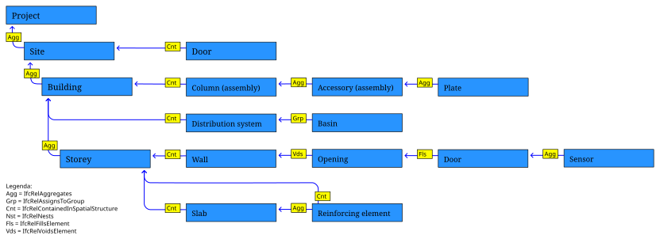

# PartOfファセット

このファセットは、part-of-of-of-otherであるオブジェクトを特定するか（適用性）、または、そうであることを要求する（要求）。

IFC のオブジェクトは他のオブジェクトと複数の関係を持つことができますが、IDS part-of は以下のタイプを再帰的にナビゲートし、エンティティが他のオブジェクトの part-of であるかどうかを判断します：

- について**ifcrelaggregates**リレーションシップとは、複数の小さなサブオブジェクトが一つの大きなオブジェクトに集約されることを説明するものである。 例えば、多くのビルの階数がビルを構成し、多くの梁、床板、ジョイントがスラブを構成し、あるいは多くのブラケット、マリオン、鋼板がアセンブリを構成する。
- について**イフクレルサインストグループ**relationresultは、複数のオブジェクトがどのようなユースケースにオブジェクトのコレクションにグループ化することができる方法を説明します。 例えば、ダクト、AHU、ファン、ルーバーは、すべて単一の配電システムにグループ化することができます。 または、ケーブル、分電盤、GPOは、単一の回路にグループ化することができます。 または、スペースはゾーンにグループ化され、または保守可能な資産は、インベントリにグループ化されます。
- について**空間構造に含まれる場合**リレーションシップは、複数のオブジェクトが特定の場所にどのように配置されるかを記述します。 例えば、ポンプはスペースに、柱はレベル2の建物の階上に、またはいくつかのストリート・ファニチャーは建物の敷地内にあるかもしれません。 すべてのオブジェクトは、複数の場所（複数階の柱など）で参照されることがあっても、IFCでは単一のプライマリ・ロケーション・コンテナを持つ必要があります。 このリレーションシップは、プライマリ・ロケーション・コンテナのみを対象とします。
- について**IFCRELNESTS**物理的なオブジェクトが、より大きなホストオブジェクトに、通常、あらかじめ開けられた穴や接続端子のような物理的な接続を介して、どのように接続されるかを説明します。 ホストが移動すると、接続されたネストされたオブジェクトも一緒に移動します。
- について**ifcrelvoidselement**関係は、空白が要素にどのように属するかを記述する。
- について**ifcrelfillselement**関係は、ある要素がどのように空白を埋め、空白の一部となるかを説明する。

そのとき`relation`パラメータが指定されていない場合は、含むエンティティを識別するために、6つすべてを（再帰的に）考慮する。そうでない場合は、指定された関係タイプだけを（再帰的に）考慮する。

## パラメータ

| パラメータ | 必須 | タイプ | 許容値 | 意味 |
| ------------ | -------- | --------------- | --------------------------------------------------------------- | ------------------------------------------------------------------------------------------------------------------------------------------------------------------------------------------------- |
| **エンティティ** | ✔️ | エンティティ・ファセット | XMLにネストされた有効なIDS `entityType` (例: "IFCSYSTEM") | 大きなオブジェクトのIFCクラスが、必要なエンティティに一致する。 |
| **関係** | ❌ | ストリング | 上記6種類のリレーションシップから1つ選択 | 省略された場合は、直接または間接的に、そして推移的に（再帰的に）評価されなければならない有効なIFC関係構造がすべて、指定された場合は、与えられたタイプのみが（再帰的に）評価されなければならない。 |

## Examples

| 適用意図 | 要件 意図 | ファセットの定義 |
| ---------------------------------------------------------------- | ------------------------------------------------------------ | --------------------------------------------------------------- |
| カーテン・ウォールを直接構成するあらゆる実体 | 実体（マリオンなど）はカーテンウォールの一部でなければならない。 | Relation="IFCRELAGGREGATES"、Entity="IFCCURTAINWALL" |
| 直接的または間接的にカーテンウォールの一部となる事業体 | 実体（マリオンなど）はカーテンウォールの一部でなければならない。 | エンティティ="IFCCURTAINWALL" |
| 流通システムの一部であるあらゆる事業体 | 事業体（ダクトなど）が配電システムの一部であること。 | 関係="IFCRELASSIGNSTOGROUP", エンティティ="IFCDISTRIBUTIONSYSTEM" |
| 空間に存在するあらゆる実体 | エンティティ（ポンプなど）は、スペースに配置されていなければならない。 | Relation="IFCRELCONTAINEDINSPATIALSTRUCTURE"、Entity="IFCSPACE" |
| ウォールによってホストされるすべてのエンティティ | エンティティ（窓など）は壁に固定されていなければならない。 | Relation="IFCRELNESTS"、Entity="IFCWALL" |

