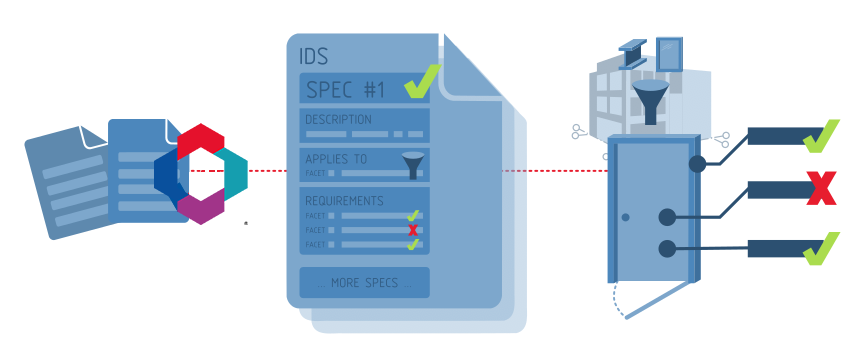

# スペックはどのように機能するのか？

A**仕様**は人間が理解しやすいように設計されている。
However, **Specifications** are also highly structured so that computer software may automatically and accurately check information requirements with no ambiguity.
Every **Specification** has three main parts:

1. **説明**その根拠についての説明**仕様**そして、それを達成するための方法を説明する。
  This part is designed for humans to read and understand why information is being requested.

  このフィールドはまた、様々な適用可能性のファセットの根拠を説明するために使用され、どのように個別ではなく、全体として資産に関連するデータ契約を識別するために役立つかを説明するために使用される。 逆に、このフィールドは`description`各要件ファセットに関するデータは、ユーザーが必要とする個々の情報の目的を理解するのに役立つはずです。

1. **適用性**指定しようとしているモデルのサブセットを特定する。
  There are many different types of objects in IFC models, but each **Specification** only applies to a subset.
  The subset can be identified via the available facets like entity (e.g. walls, windows), classification (e.g. Uniclass EF_25_10_25  External walls), and others.
1. **必要条件**要求される特性や材料など、適用性で特定されたサブセットに対してどのような情報が必要であるか。

例えば**仕様**の"_すべての壁には耐火等級が必要_"はこのような構造になっている：

 1. **説明**壁の防火等級は建築基準法に適合するために重要である。
 1. **適用性**この仕様はすべての壁面に適用されます。
 1. **必要条件**前述の壁材は、防火性能を有していなければならない。

## 仕様書は情報をどのように記述できるか

**適用性**そして**必要条件**コレクションを使用して記述される。**ファセット**. A**ファセット**は、モデル内の1つのエンティティ（壁やドアなど）が持つ可能性のある情報を記述します。
A **Facet** describes its information precisely using fixed **Facet Parameters** so that computers can understand exactly what information you are after.

を使用する。**ファセット**で使用されている。**適用性**セクションでは、モデルの関連部分を特定するために使用する情報について説明する。

を使用する。**ファセット**で使用されている。**必要条件**セクションで、モデル部品が以下に準拠するために満たさなければならない情報制約を記述する。**仕様**.



6種類ある。**ファセット**情報の

| ファセット・タイプ | ファセット・パラメータ | 適用例 | 要件例 |
| ------------------ | ----------------------------------------- | -------------------------------------------------------------------------------------------------------- | -------------------------------------------------------------------------------------- |
| **エンティティ** | **IFCクラス**および**定義済みタイプ** | IfcWall "の定義済みタイプが "SHEAR "の場合に適用される。 | 定義済みのタイプ "SHEAR "を持つ "IfcWall "でなければならない。 |
| **属性** | **名前**と**値** | 属性 "Name "の値が "W01 "である要素に適用される。 | 値 "W01 "の属性 "Name "を持たなければならない。 |
| **分類** | **システム**と**バリュー** | ユニクラス2015」で "EF_25_10_25 "に分類される要素に適用される。 | EF_25_10_25 "の "Uniclass 2015 "分類参照を持っていなければならない。 |
| **プロパティ** | **プロパティセット**、**名前**、**値** | プロパティセットが "Pset_WallCommon "で、"LoadBearing "プロパティが "TRUE "に設定されている要素に適用される。 | Pset_WallCommon "プロパティに "LoadBearing "プロパティが "TRUE "に設定されていること。 |
| **素材** | **価値** | 具体的な」要素に適用される | 具体的」な素材であること |
| **部品** | **エンティティ**と**リレーションシップ** | IfcSpace "に "含まれる "要素に適用される。 | IfcSpace "に "含まれなければならない。 |

You can combine multiple **Facets** together in either the **Applicability** or **Requirements** section to describe a wide variety of **Specifications**.
Some **Facets** may have optional **Facet Parameters**.
For example, if you want to specify that a property should exist, but not the exact value, you may omit the value parameter of the **Property Facet**.

また、有効な値のリスト、数値の範囲、テキスト・パターンを指定することもできます。**ファセット・パラメータ**これらは次のように呼ばれている。**複合施設の制限**.
For example, you would use a **Complex Restriction** to specify that a fire rating property must choose from either the value "0HR", "1HR", or "2HR" only.

食欲をそそるいくつかの例を紹介しよう：

| 意図 | 適用性 | 必要条件 |
| ----------------------------------------------------------------------------------- | -------------------------------------------------------------------------------------------------------------------------------------------------------------------------- | ---------------------------------------------------------------------------------------------------------------------------------------------------------------------------------------------------------------------------------------------- |
| 外壁の耐力壁には、法令に適合する耐火等級が必要である。 | <ul><li>**Entity Facet** (**IFCクラス**はIfcWall)</li><li>**Property Facet** (**プロパティセット**はPset_WallCommon、**名前**はLoadBearing、**値**はTRUE)</li></ul>。 | <ul><li>***Property Facet** (**Property Set** is Pset_WallCommon, **Name** is FireRating)</li></ul> |
| 寝室は最低10m2以上の広さが必要 | <ul><li>**Entity Facet** (**IFCクラス**はIfcSpace)</li><li>**Attribute Facet** (**Description**は "BEDROOM "というテキストを含むこと)</li></ul>。 | <ul><li>***Property Facet** (**Property Set** is Qto_SpaceBaseQuantities, **Name** is NetFloorArea, **Value** is >= 10)</li></ul> |
| すべてのレンガ壁の種類を分類し、承認された命名規則に従わなければならない。 | <ul><li>**Entity Facet** (**IFCクラス**はIfcWallType)</li><li>**Material Facet** (**値**はレンガ)</li></ul>。 | <ul><li>**Classification Facet** (**System** is Uniclass 2015, **Value** must start with EF_25_10)</li><li>**Attribute Facet** (**Name** is Name, **Value** must be letters "WT" followed by 2 numbers, such as WT01, WT02, etc.)</li></ul>. |

To see the full capabilities of what each information each **Facet** can specify, see the sections below for more detail.

## カーディナリティ

### 適用可能エンティティのカーディナリティ

それぞれ**仕様**は、適用可能性の基準に一致するモデルの部分集合が、以下のように定義されている。**必須**,**オプション**あるいは**禁止**.
Given an example like the following:

```txt
applicability =  Type = walls 
                 Property = IsExternal
requirement   =  Property = FireRating
```

以下の解釈が適用される：

| minOccurs | maxOccurs | 解釈 | 意味 |
| --------- | --------- | -------------- | ---------------------------------------------------------------------------------------------------------------------------------- |
| 1 | 無制限 | **必須** | IFCモデルには、IsExternalプロパティを持つ壁が少なくとも1つ存在し、そのような壁にはそれぞれ耐火等級プロパティが必要です。 |
| 0 | 無制限 | **任意** | IsExternalプロパティを持つ壁は、モデルのオプションである。 |
| 0 | 0 | **禁止** | IsExternalプロパティを持つ壁がモデル内に見つかってはならない。 |

### Cardinality of requirements

個々の要件ファセットでは、次のように指定することもできます。**必須**,**オプション**あるいは**禁止**.

次のプロパティのような例がある：

```txt
Requirement 1: Property
    propetySet: ePset_SpaceOMA 
    property: TravelDirection
    datatype: IFCLABEL
```

以下の解釈が適用される：

| タイプ | 意味 | 成功の基準 |
| -------------- | ------------------------------------------------------------------------------------- | --------------------------------------------------------------------------------------------------------- |
| **必須** | モデルにマッチするプロパティが必要 | 一致するエンティティは、IFCLABEL型でNULLでない値のePset_SpaceOMA/TravelDirectionプロパティを持つ。 |
| **禁止** | 一致するプロパティがモデル内に存在しない | 一致するエンティティのePset_SpaceOMAプロパティセットにTravelDirectionプロパティがありません。 |
| **任意** | propertySet/propertyの期待値と値の制約は定義されていますが、オプションです。 | 一致するエンティティは、そのプロパティを持っていないか、持っていても期待されるデータ型と値である。 |

As a complete example, you might have a **Required** specification that applies to wall entities, that are **Prohibited** from being load-bearing, if you wanted your model to not contain any load-bearing walls.

## IFCスキーマのサポート

それぞれ**仕様**は、適用するIFCスキーマを定義します。 サポートされるIFCスキーマは以下のとおりです：

- IFC4X3_ADD2
- IFC4
- IFC2X3

IDSは、提供されたIFCモデルに有効なデータのみが含まれていることを前提としています。 モデルに構文エラーやIFCスキーマ検証エラーがある場合、モデルを検証できないことがあります。
It is the responsibility of the IFC authoring software to ensure that the produced IFCs are valid.

## 制限事項

IDSの最初のバージョンは、すべての分野に共通するIFCの基本的な情報と関係を対象としている。
More advanced information requirements are currently out of scope for IDS.
For example, geometry checks, checks that rely on calculated or dynamic values, checks that reference data outside the IFC model, or use domain specific IFC relationships are not possible.

ここでは、監査を支援する他のツールを必要とする高度な要件のタイプをいくつか紹介する：

- 構造梁とパイプがぶつからないこと
- すべての壁は敷地境界から3m離す必要がある。
- すべてのオフィススペースの合計面積が300m2以上であること。
- すべてのドアタイプの名前は一意でなければならない
- すべてのポンプは、指定されたサプライヤーとメーカーを持つ必要がある。
- すべてのエアハンドリングユニットには、トリガーイベントを割り当てたセンサーが必要です。
- すべての勤務スケジュールにおいて、土曜日と日曜日は休日でなければならない
- 主要なソフトウェア・ベンダーは、全モデルを3分以内にロードしなければならない。
- モデル内の関連図面は、CDE の最新リビジョンと一致していなければならない。
- すべての鉄筋はパラメトリックな掃引ディスクとしてモデル化されるべきである。
- 模型は建設時の状態と一致していなければならない。
